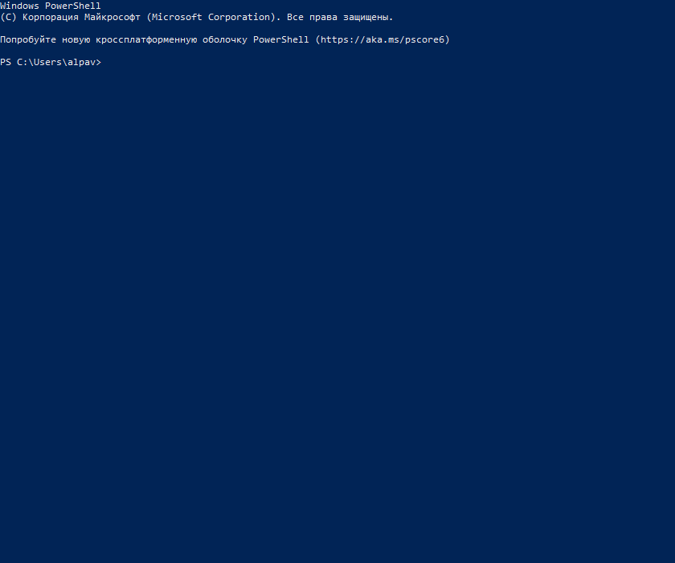

# Library
A console application for managing a library of books.
##### A test assignment from the company Effective Mobile
___

## Start application  
```bash
git clone https://github.com/TurtleOld/test_task_library.git
cd test_task_library
python library/main.py
```
___
## Functionality  
- Adding a book 
- Deleting a book 
- Searching for a book 
- Displaying all books 
- Changing the status of a book
___

## Example Usage  
